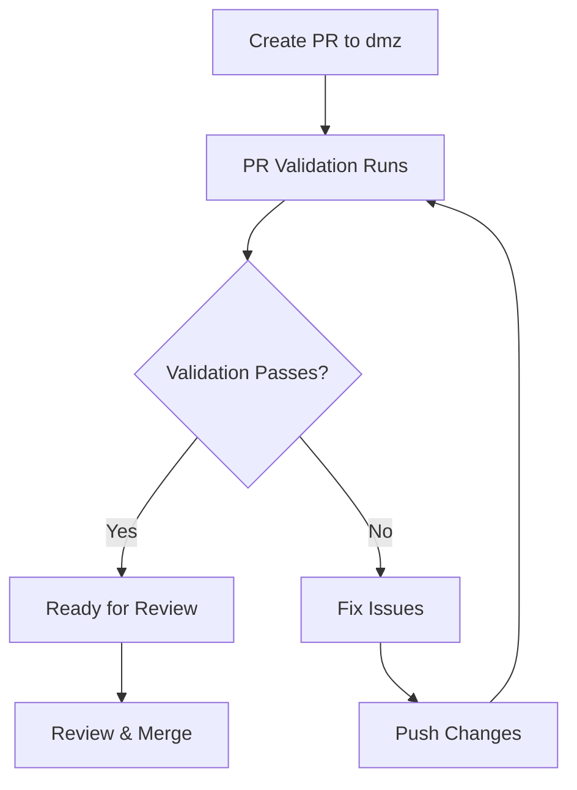

# DMZ Git Flow Implementation

This document explains the DMZ Git Flow implementation using GitHub Actions workflows. This workflow ensures that the `main` branch remains clean and deployable while allowing safe integration of changes through the `dmz` branch.

## Overview

The DMZ Git Flow consists of three main workflows:

1. **PR Validation** - Validates pull requests targeting the `dmz` branch
2. **DMZ Validation** - Validates the `dmz` branch and fast-forwards `main` if successful
3. **DMZ Revert** - Reverts problematic commits from the `dmz` branch

## Workflow Architecture

### Branch Structure

```
main (clean, deployable)
  ↑
dmz (integration branch)
  ↑
feature branches (developer forks)
```

### Key Principles

- **Main branch is always clean**: Never accepts direct PRs from developers
- **DMZ branch is the integration point**: All PRs target the `dmz` branch
- **Automated validation**: All changes are validated before reaching `main`
- **Fast-forward only**: `main` is only updated via fast-forward from `dmz`
- **Automatic rollback**: Failed builds can be automatically reverted

## Workflows

### 1. PR Validation Workflow (`.github/workflows/pr-validation.yml`)

**Triggers:**
- Pull requests targeting `dmz` branch
- Pull request updates

**What it does:**
- Detects which starter applications have changes
- Runs validation only on changed starters (optimized performance)
- Performs linting, formatting, type checking, building, and testing
- Comments on the PR with validation results
- Updates existing comments on subsequent runs

**Key Features:**
- **Smart change detection**: Only validates starters that have changes
- **Global change handling**: Validates all starters if global files change
- **Automated PR comments**: Provides clear feedback to developers
- **Incremental validation**: Updates existing comments instead of creating new ones

### 2. DMZ Validation Workflow (`.github/workflows/dmz-validation.yml`)

**Triggers:**
- Pushes to `dmz` branch

**What it does:**
- Validates all enabled starter applications
- Runs comprehensive checks (linting, formatting, type checking, building, testing)
- Fast-forwards `main` branch to `dmz` if validation passes
- Creates success/failure notifications
- Provides clear next steps for failures

**Key Features:**
- **Comprehensive validation**: Tests all enabled starters
- **Automatic fast-forward**: Updates `main` only when validation passes
- **Mandatory testing**: All tests must pass before main branch updates
- **Detailed reporting**: Provides clear success/failure summaries

### 3. DMZ Revert Workflow (`.github/workflows/revert-dmz.yml`)

**Triggers:**
- Manual workflow dispatch only

**What it does:**
- Reverts specified commits from `dmz` branch
- Creates tracking issues for reverted commits
- Notifies related PRs about the revert
- Provides detailed revert information

**Key Features:**
- **Flexible commit targeting**: Can revert specific commits or latest commit
- **Automatic tracking**: Creates issues to track revert reasons and fixes
- **PR notification**: Comments on related PRs about the revert
- **Detailed documentation**: Provides comprehensive revert information

## Usage Guide

### For Developers

#### Creating a Pull Request

1. **Fork the repository** and create a feature branch from `main`
2. **Make your changes** in your feature branch
3. **Create a PR** targeting the `dmz` branch (not `main`)
4. **Wait for validation** - the PR validation workflow will run automatically
5. **Address any issues** if validation fails
6. **Request review** once validation passes

#### PR Validation Process



#### After PR Merge

1. **PR is merged** to `dmz` branch
2. **DMZ validation** runs automatically
3. **If successful**: `main` branch is fast-forwarded automatically
4. **If failed**: Fix issues and push to `dmz` branch

### For Maintainers

#### Manual Operations

**Revert Problematic Commits:**
```bash
# Via GitHub Actions UI
# Go to Actions > Revert DMZ Branch
# Click "Run workflow" and provide:
# - Commit SHA (optional, defaults to latest)
# - Reason for revert
```

#### Monitoring

- **Check Actions tab** for workflow status
- **Review PR comments** for validation results
- **Monitor issues** created by revert workflow
- **Watch for notifications** about fast-forward operations

## Security Requirements

### Required Branch Protection Rules

To ensure the DMZ workflow provides maximum security, the following branch protection rules **MUST** be configured for the `main` branch:

#### 1. Require Status Checks
- **Enable**: "Require status checks to pass before merging"
- **Required Status Checks**: 
  - `validate-dmz` (from DMZ validation workflow)
  - `pr-validation` (from PR validation workflow)
- **Enable**: "Require branches to be up to date before merging"

#### 2. Restrict Push Access
- **Enable**: "Restrict pushes that create files"
- **Enable**: "Restrict pushes that create files" 
- **Restrict pushes to matching branches**: Only allow pushes from DMZ workflow

#### 3. Required Reviews
- **Enable**: "Require pull request reviews before merging"
- **Required number of reviewers**: 1 (minimum)
- **Enable**: "Dismiss stale pull request approvals when new commits are pushed"

#### 4. Additional Security
- **Enable**: "Require conversation resolution before merging"
- **Enable**: "Require signed commits"
- **Enable**: "Require linear history"

### Configuration Steps

1. **Go to Repository Settings** > Branches
2. **Add rule** for `main` branch
3. **Configure all settings** listed above
4. **Save changes**

⚠️ **Important**: Without these branch protection rules, the DMZ workflow can be bypassed by direct pushes to the main branch.

## Configuration

### Environment Variables

The workflows use the following environment variables:

- `NODE_VERSION`: Set to `22.11.0` (matches xmcloud.build.json)
- `GITHUB_TOKEN`: Automatically provided by GitHub Actions

### Starter Applications

The workflows automatically detect and validate these starter applications:

- `kit-nextjs-skate-park`
- `kit-nextjs-article-starter`
- `kit-nextjs-location-finder`
- `kit-nextjs-product-listing`

### Required npm Scripts

Each starter application should have these npm scripts:

```json
{
  "scripts": {
    "lint": "eslint . --ext .ts,.tsx",
    "format:check": "prettier --check .",
    "format": "prettier --write .",
    "type-check": "tsc --noEmit",
    "build": "next build",
    "test": "jest"
  }
}
```

## Troubleshooting

### Common Issues

#### PR Validation Fails

**Linting Errors:**
```bash
# Fix linting issues
npm run lint -- --fix
```

**Formatting Issues:**
```bash
# Fix formatting
npm run format
```

**Type Errors:**
```bash
# Check TypeScript errors
npm run type-check
```

**Build Failures:**
- Check for missing dependencies
- Verify import paths
- Check for syntax errors

#### DMZ Validation Fails

1. **Check the workflow logs** for specific error details
2. **Fix issues** in the `dmz` branch
3. **Push fixes** to trigger re-validation
4. **Use revert workflow** if needed to remove problematic commits

#### Fast-Forward Issues

1. **Check if `dmz` is ahead** of `main`
2. **Verify validation passed** before fast-forward
3. **Fix validation failures** - no bypassing allowed
4. **Check for merge conflicts** in the logs

### Emergency Procedures

#### Immediate Rollback

1. **Use revert workflow** to remove problematic commits
2. **Specify the commit SHA** that caused issues
3. **Provide clear reason** for the revert
4. **Monitor the revert process**

#### Handling Validation Failures

1. **Fix the underlying issues** causing validation failures
2. **Push fixes to dmz branch** to trigger re-validation
3. **Use revert workflow** if commits need to be removed
4. **No bypassing allowed** - all tests must pass

## Benefits

### For Development Teams

- **Clean main branch**: Always deployable and reliable
- **Automated validation**: Catches issues before they reach production
- **Clear feedback**: Detailed validation results and next steps
- **Rollback capability**: Easy reversion of problematic changes

### For CI/CD

- **Predictable builds**: Main branch is always in a good state
- **Fast feedback**: Issues caught early in the process
- **Automated deployment**: Main branch can be deployed automatically
- **Quality gates**: Multiple validation layers ensure code quality

### For Project Management

- **Traceability**: Clear history of changes and reverts
- **Accountability**: Issues track who made changes and why
- **Visibility**: Clear status of all validation processes
- **Reliability**: Reduced risk of broken deployments

## Future Enhancements

### Planned Improvements

1. **Slack/Teams Integration**: Notifications for workflow status
2. **Deployment Integration**: Automatic deployment on successful fast-forward
3. **Metrics Dashboard**: Track validation success rates and performance
4. **Advanced Rollback**: Support for reverting multiple commits
5. **Branch Protection**: Enforce DMZ flow with branch protection rules

### Configuration Options

1. **Custom Validation**: Allow per-starter validation rules
2. **Parallel Execution**: Run validations in parallel for faster feedback
3. **Caching**: Cache dependencies and build artifacts
4. **Notifications**: Configurable notification channels

## Support

For questions or issues with the DMZ Git Flow:

1. **Check this documentation** for common solutions
2. **Review workflow logs** for specific error details
3. **Create an issue** with detailed information about the problem
4. **Contact the maintainers** for urgent issues

---

*This documentation is automatically updated with the workflow implementations.*


